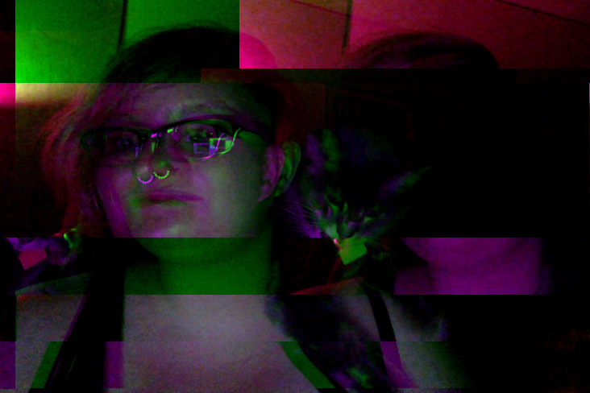

Hi! I'm kf, a coding-inclined, `cat-inclined <http://catcatcatcatc.at>`_ twenty-something.

Currently, I work as a data engineer at `Simple <https://simple.com>`_ in Portland, OR. Previously, I worked on distributed systems at `Comcast <http://labs.comcast.com>`_ in Philly and as a freelance Scala developer for startups in San Francisco.

I've spent most of my time in industry working remotely, and I have a penchant for functional programming. I've taught workshops on Scala and Clojure, as well as given conference talks on developer workflows and community organizing.

In my spare time, I've been on the boards of `ClojureBridge <http://clojurebridge.org>`_ and `Bridge Foundry <http://bridgefoundry.org>`_; helped organize `Philly ETE <http://phillyemergingtech.com>`_, `Open Source Bridge <http://opensourcebridge.org>`_, and `PLIBMTTBHGATY <http://plibmttbhgaty.com>`_; and started the Philly and Portland chapters of `Papers We Love <http://paperswelove.org>`_. I was a key-holding member at `Double Union <https://doubleunion.org>`_ in San Francisco for several years, and I'm an alumni and former mentor of `Hackbright Academy <https://hackbrightacademy.com>`_, as well.

If you'd like to hear more about my work and background, you can `drop me a line <contact.html>`_ or check out my interviews on the `Cognicast <http://blog.cognitect.com/cognicast/085>`_ and `The Bike Shed <http://bikeshed.fm/60>`_.
